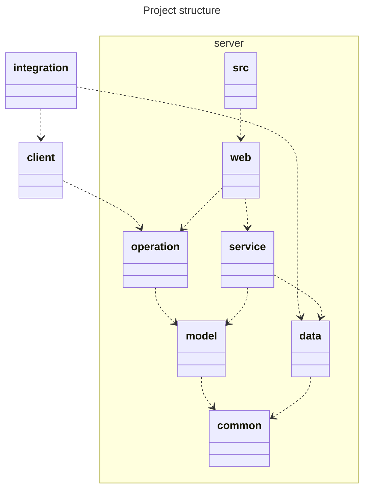

# BSS Web admin backend


[](https://sonarcloud.io/dashboard?id=BSStudio_bss-web-admin-backend)
[](https://sonarcloud.io/dashboard?id=BSStudio_bss-web-admin-backend)
[](https://sonarcloud.io/dashboard?id=BSStudio_bss-web-admin-backend)
[](https://sonarcloud.io/dashboard?id=BSStudio_bss-web-admin-backend)
[](https://sonarcloud.io/dashboard?id=BSStudio_bss-web-admin-backend)
[](https://sonarcloud.io/dashboard?id=BSStudio_bss-web-admin-backend)
[](https://sonarcloud.io/dashboard?id=BSStudio_bss-web-admin-backend)
[](https://sonarcloud.io/dashboard?id=BSStudio_bss-web-admin-backend)
[](https://sonarcloud.io/dashboard?id=BSStudio_bss-web-admin-backend)
[](https://sonarcloud.io/dashboard?id=BSStudio_bss-web-admin-backend)


> Note: client can only access operation, model, common. No business code

> Note: integration can only access client (with everything mentioned above) and data. No business code

## Development

### Pre-requisites

Download sdkman to manage java and gradle versions.

```shell
git clone git@github.com:BSStudio/bss-web-admin-backend.git
cd bss-web-admin-backend
sdk env install
```

### Lint

```shell
./gradlew spotlessCheck
```

### Apply lint

```shell
./gradlew spotlessApply
```

### Test

```shell
./gradlew test
```

### Integration test

```shell
docker compose up -d
./gradlew integrationTest
docker compose down
```

### Build

Docker:

```shell
docker build -t bss-web-admin-backend .
```

Gradle:

```shell
./gradlew build
```

### Run

Docker:

```shell
docker run bss-web-admin-backend
```

Docker compose:

```shell
docker compose up
```

Gradle:

```shell
./gradlew bootRun
```
