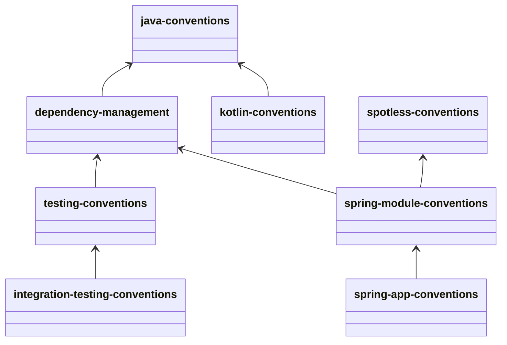

# The build config
This module stores the build configuration for the application.

There are conventions configured for most use cases.

## Java conventions
The Java conventions will set the language level and set up the annotation processor.

## Kotlin conventions
The Kotlin conventions will set up the Kotlin compiler to be compatible with Spring.
It's based on [Spring Initializr][spring-initializr].

## Dependency management
Will set up the BOM and the repositories for the project.

## Integration testing conventions
Will set up the integration testing configuration.
It will create a new scope: `integrationTest`.
It's based on [Gradle's documentation to set up integration tests][gradle-integration].

## Spotless conventions
Will set up the code formatter.

## Testing conventions
Will set up the testing configuration.
It will configure JUnit and Jacoco.
Set coverage to 100% and enforce the coverage.
There are a few exceptions to the coverage enforcement.
The coverage is enforced by the `check` lifecycle.
There's always coverage reports generated after the tests are run.

## Spring module conventions
Will set up dependency management and enforce spotless conventions.

## Spring app conventions
Will set up aggregated jacoco and test reports.
It also enforces the [`module-conventions`](#spring-module-conventions).
It will pull in the `org.springframework.boot` plugin to enable the `bootJar` task.
It will enable the configuration processor and the devtools dependency.
The latter is only enabled in the developmentOnly scope.
It will also use the `spring-boot-starter` dependency to autowire the dependencies.

[spring-initializr]: https://start.spring.io/
[gradle-integration]: https://docs.gradle.org/current/userguide/java_testing.html#sec:configuring_java_integration_tests
