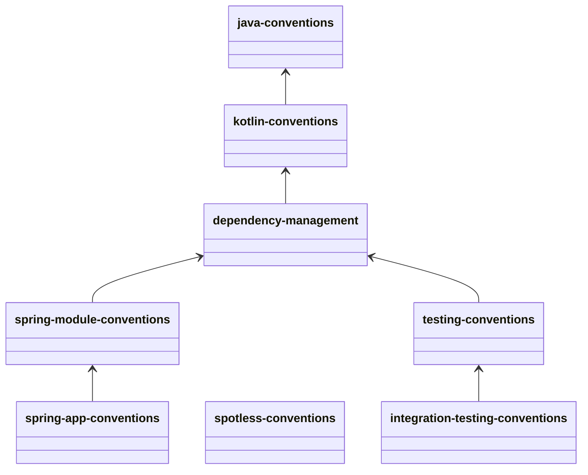

# The build config
This module stores the build configuration for the application.

There are conventions configured for most use cases.

```mermaid
classDiagram

direction BT

class java-conventions
class kotlin-conventions
class dependency-management
class integration-testing-conventions
class spotless-conventions
class spring-app-conventions
class spring-module-conventions
class testing-conventions

kotlin-conventions --> java-conventions
integration-testing-conventions --> testing-conventions
spring-app-conventions --> spring-module-conventions
spring-module-conventions --> dependency-management
dependency-management --> kotlin-conventions
testing-conventions --> dependency-management
```

Todo: describe each convention