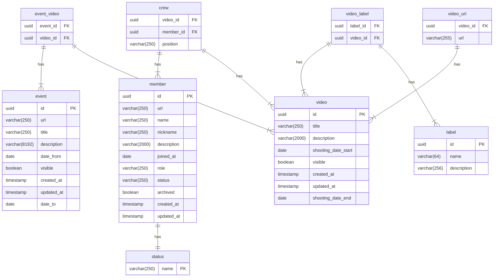

# Data module

This module holds all the interfaces
for every repository and their respective entities.

This module also holds the database migrations.

## Flyway migrations

The project uses [Flyway][flyway] for database migrations.
If you need to make any changes to the database schema,
you should create a new migration file in the
[`src/main/resources/db/migration`][migrations-folder]
directory.

### Schemas
The project uses the `private` schema for all the tables.
The `public` schema is used for rendering views for the [GraphQL backend][graphql-backend].

## Testing

The tests in this module will set up a Postgres database
with the help of [Testcontainers][testcontainers].

This means that you need docker running on your machine when running these tests

You can skip these test during your local build using `-x :server:data:test`

```shell
# run all tests except :server:data
./gradlew -x :server:data:test test
```

Since the project is so well-structured,
there's no need to apply labels on these tests,
the module can be excluded from the build process.

You can set the postgres container version in the
[`src/test/resources/application.yml`][test-properties]
file.

## ER diagram



[flyway]: https://flywaydb.org/

[migrations-folder]: src/main/resources/db/migration

[graphql-backend]: https://github.com/BSStudio/bss-web-graphql-backend

[testcontainers]: https://www.testcontainers.org/quickstart/junit_5/

[test-properties]: src/test/resources/application.yml
